# Cloud Firestoreを使ってみよう

## Cloud Firestoreとは

## プロジェクトを作成する

Firebaseのプロジェクトを新しく作成しましょう。
作成したら、コンソールの左側の開発タブからCloud Firestoreをクリックしましょう。

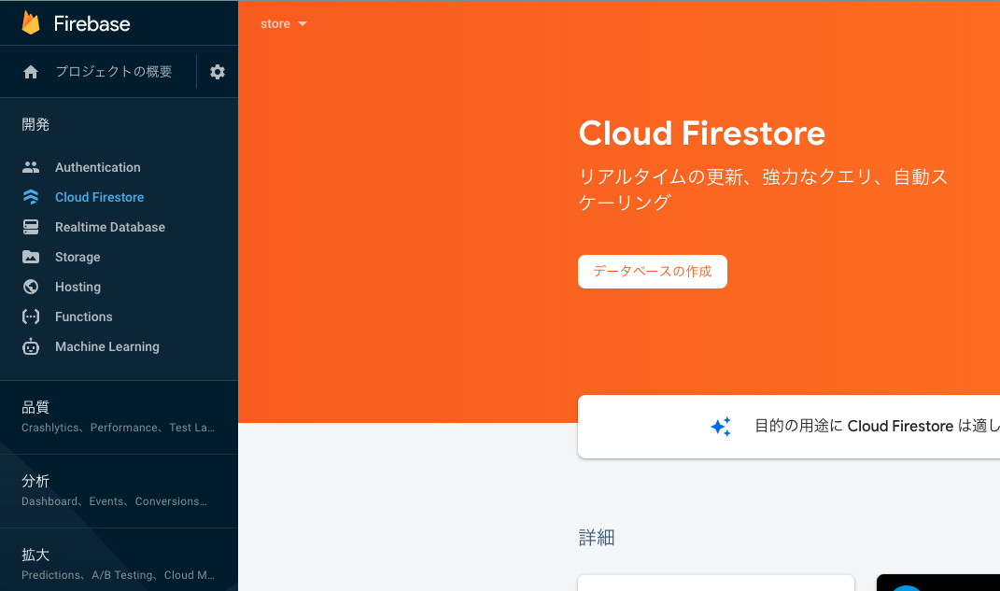

次に**データベースの作成**をクリックします。

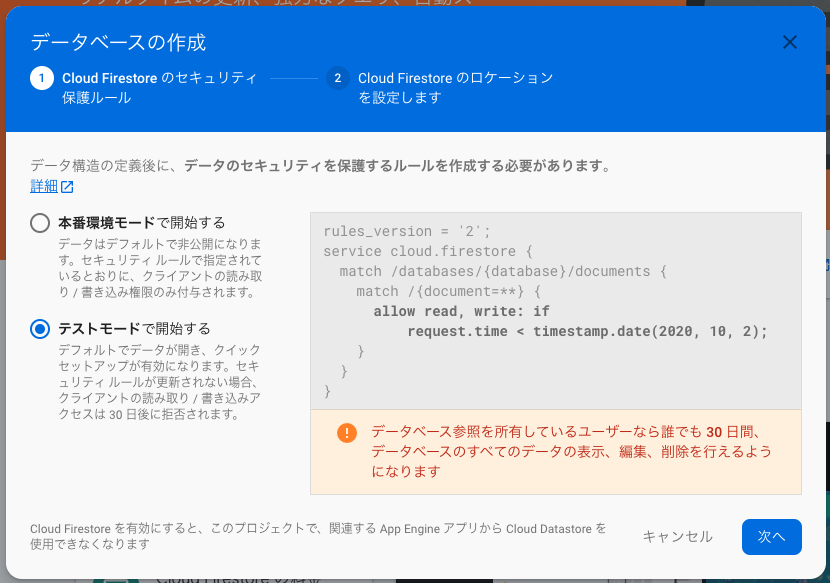

**テストモード**で開始するを選択してください。

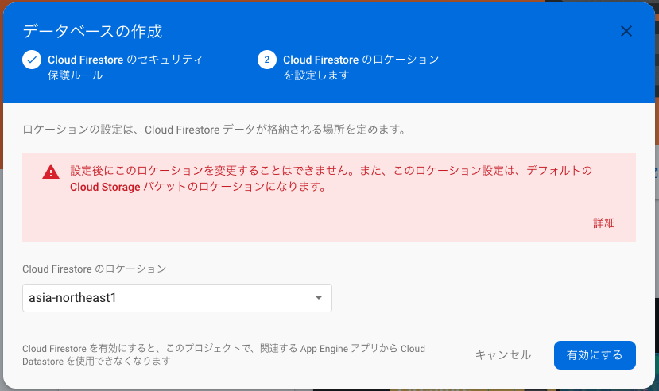

ロケーションは今回は**asia-northeast1**を選択してください。

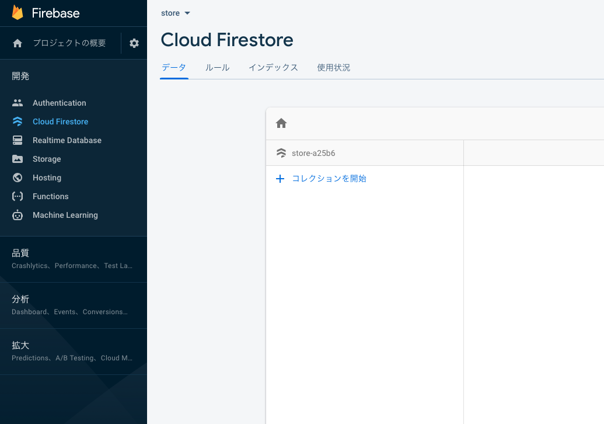

試しにデータを作成してみましょう。コレクションを開始をクリックしてください。

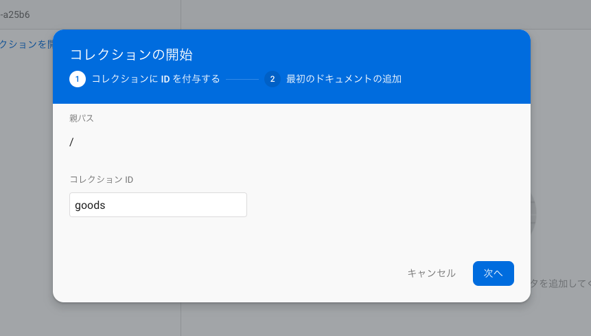

コレクションIDに**goods**と入力してください。

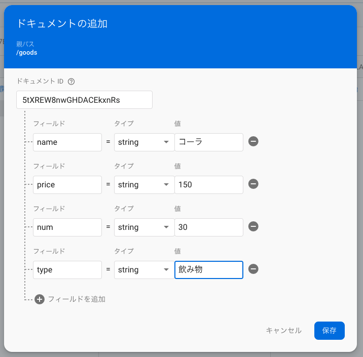

好きなようにデータを入力してみましょう。
これがCloudFirestoreでのデータの形になります。


では、ウェブアプリを追加しましょう。

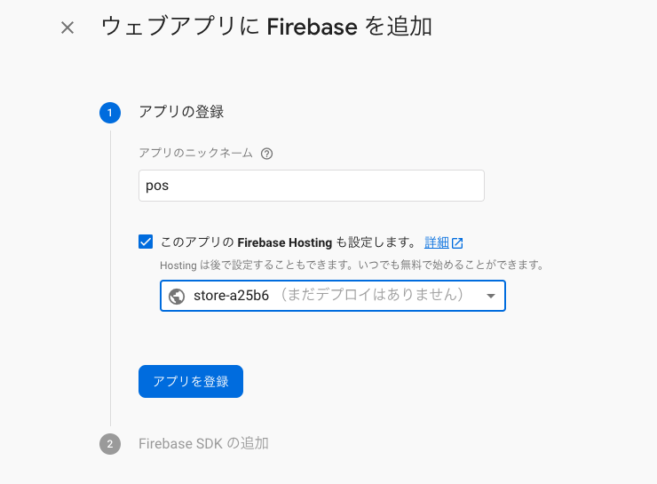

アプリのニックネームには好きな名前を登録してください。
ここでは、POSと命名しました。

Firebase SDKの追加は後ほど説明するので、今は大丈夫です。

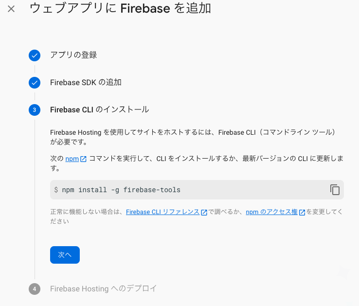

Firebase CLIのインストールを行います。
今後いくつかFirebaseのプロジェクトを作成していくと思うので、新しいフォルダを作成して、その中にインストールしてください。
テキストでは新しく**cloudfirestore_tutorial**というフォルダをパソコンに作成し、その中にインストールしました。

ターミナルで、作成したフォルダに移動し、以下のコマンドを実行すると、Firebase CLIがインストールされます。
```
npm install -g firebase-tools
```
以下の画面になったら、矢印キーとスペースキーを利用して**Firestore**と**Hosting**を選択し、Enterキーを入力してください。

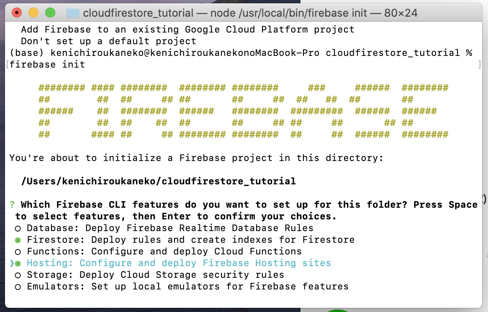
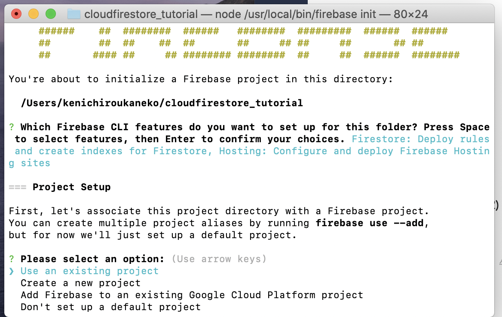
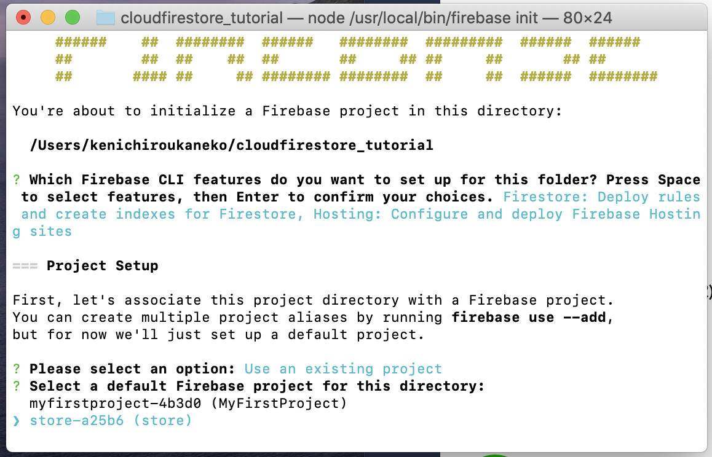
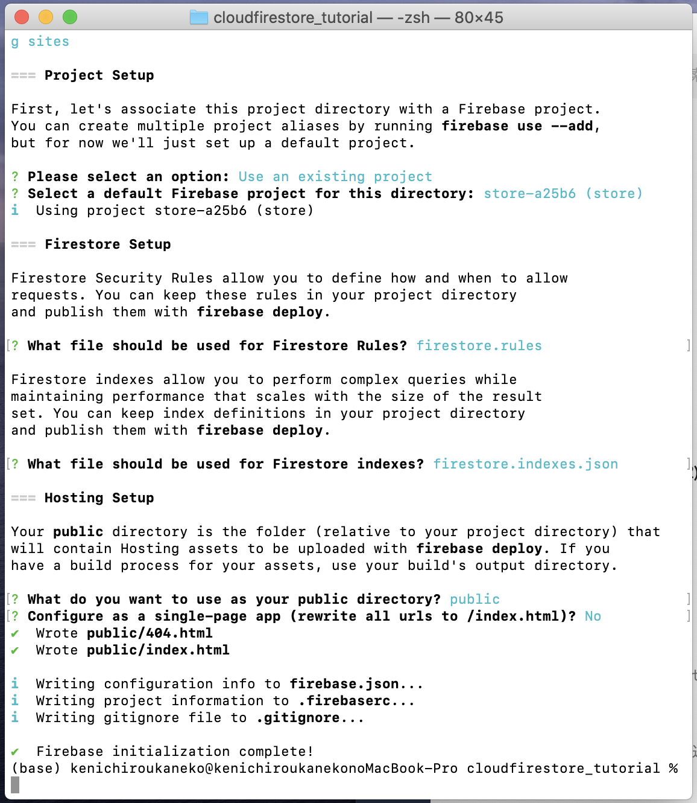


