# Slackbotを作ろう

このテキストは2020年8月31日の勉強会で利用した資料です。

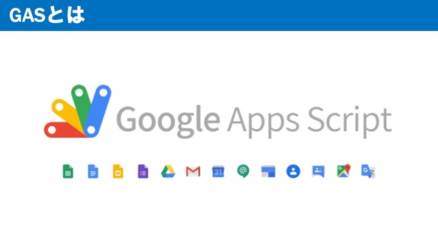

GASとは、Gmailやスプレッドシートなどを操作できるプログラミング言語です。書き方はJavaScriptとほぼ同じであり、環境構築も簡単であるため、簡単に始めることができます。

</br>

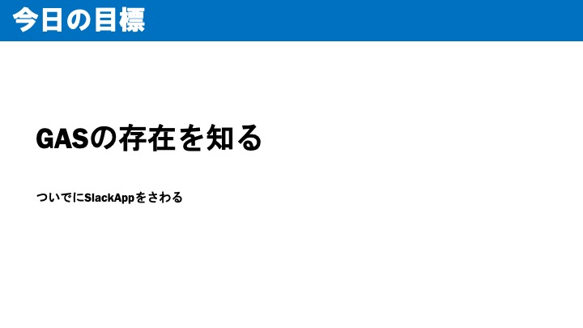

このテキストの目標はGASの存在を知ることです。  
いろいろなツールを知っていることで、実装の幅が広がります。

</br>
<hr>

## 例1　カレンダーの通知を自分好みに作る

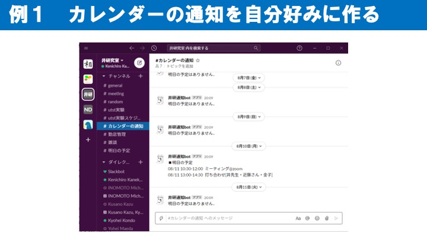

このテキストは、「とりあえず何か作ってみる」という方針で作りました。３つの例がありますので、是非手を動かしながら読み進めてください。  
まずは例1「カレンダーの通知を自分好みに作る」です。  

</br>

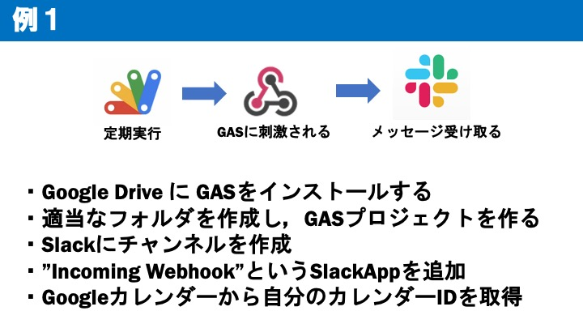

大まかな手順です。  
GoogleDriveの `新規->その他->アプリを追加` からGASを追加します。  
次にGoogleDrive内でフォルダを作成し、新規作成からGASプロジェクトを作成します。  
そしてSlackを開き、通知用のチャンネルを作成します。**プライベートチャンネルにはしないでください。** パブリックチャンネルじゃないと、このあとのIncoming webhookがチャンネルに追加できません。

</br>

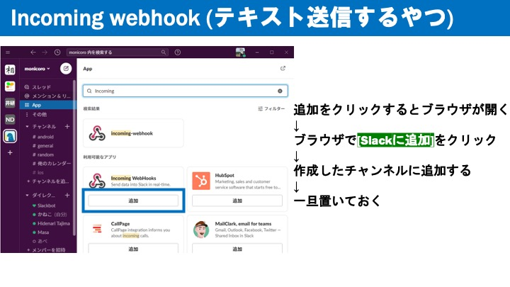

先ほどの手順の4つ目の解説です。  
SlackからIncoming webhookを追加します。  
**Incoming webhookの設定画面にWebhookURLと言うものがあります。後ほど使いますので覚えておいてください。**

</br>

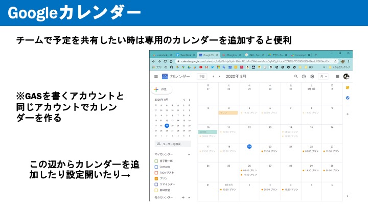

先ほどの手順の5爪の解説です。  
自分のプライベートの予定をチームで共有したくないと思いますので、ここでは、 `他のカレンダー->新しいカレンダーを作成` から、新しいカレンダーを作成してください。

</br>

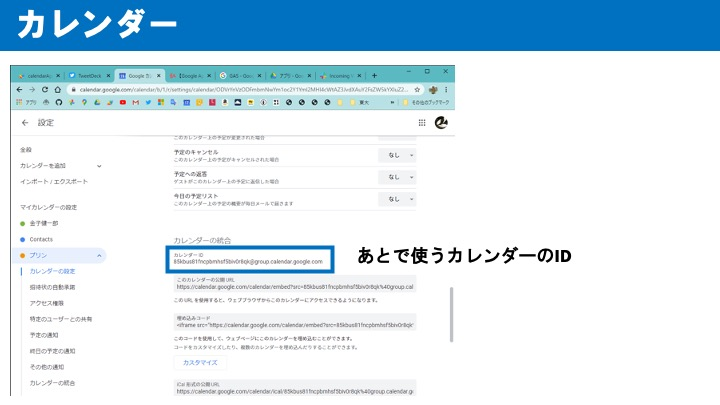

新しく作成したカレンダーの `設定と共有` を開き、下の方に行くと **カレンダーID** を確認することができます。後ほど使います。

</br>

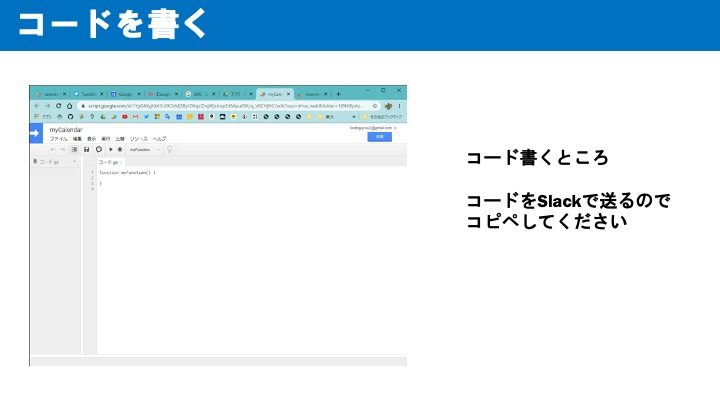

先ほど作成したGASプロジェクトを開き、コードを書いていきます。  
以下のコードをコピペして、何箇所か自分で変更しなければいけない点があるので、書いてある通りに変更してください。  

```js
function myFunction() {

  var list = "";
  var s;

  s = listupEvent(""); // GoogleカレンダーのID
  //  予定がある日の処理
  if (s != "") {
    list += "\n■明日の予定\n" + s; // メッセージの見出し
    var payload = {
      "text" : "\n" + list, // メッセージの本文
      "channel" : "#カレンダーの通知", // チャネルの指定（正しく書く！）
      "username" : "プリン通知bot", // Botの名前
    }
    postSlack(payload);

  // 予定がない日の処理
  }  else {

    var payload = {
      "text" : "明日の予定はありません．\n", // メッセージの本文
      "channel" : "#俺のカレンダー", // チャネルの指定（正しく書く！）
      "username" : "プリン通知bot", // Botの名前
    }
    postSlack(payload);
  }

  Logger.log(list);

}

// カレンダーの予定を取得する関数
function listupEvent(cal_id)
{
  var list = "";
  var cal = CalendarApp.getCalendarById(cal_id);

  var targetDate = new Date();
  // ここで+1しているため，明日の予定が取得できる
  targetDate.setDate(targetDate.getDate()+1);
  var events = cal.getEventsForDay(targetDate);

  for(var i=0; i < events.length; i++){
    s = "";
    if (events[i].isAllDayEvent()) {
      s += Utilities.formatDate(events[i].getStartTime(),"GMT+0900","MM/dd  ");
    } else {
      s += Utilities.formatDate(events[i].getStartTime(),"GMT+0900","MM/dd HH:mm");
      s += Utilities.formatDate(events[i].getEndTime(), "GMT+0900","-HH:mm  ");
    }
    s += events[i].getTitle();
    Logger.log(s);

    list += s + "\n";
  }

  return list;
}

// Slackに投稿する関数
function postSlack(payload)
{
  var options = {
    "method" : "POST",
    "payload" : JSON.stringify(payload)
  }

  var url = ""; // g. Webhook URL
  var response = UrlFetchApp.fetch(url, options);
  var content = response.getContentText("UTF-8");

}
```  


</br>

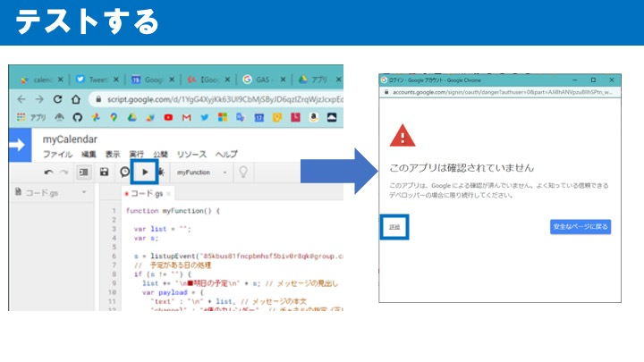

テストしてみましょう。  
警告が出てしまいますが、詳細をクリックし、進めてください。  
成功すると、作成したslackのチャンネルに、予定を通知するメッセージが届くと思います。

</br>

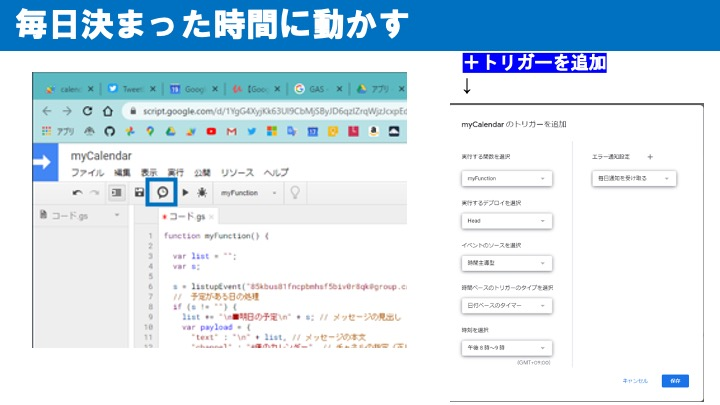

最後に、定期実行の設定を行って完成です。  

</br>

<hr>
## 例2　勤怠管理
  
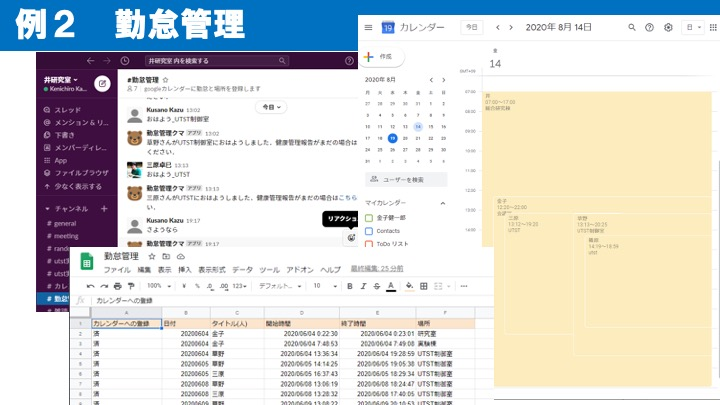

この例では、Googleカレンダーとスプレッドシートを利用して、勤怠管理を行うbotを作ります。


</br>

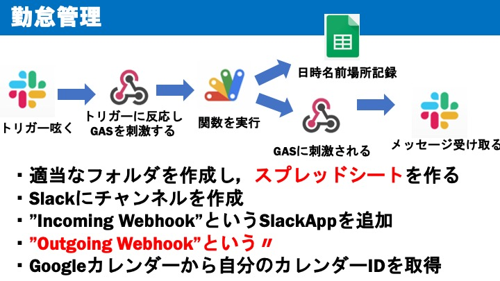

実装の流れです。先ほどと同じような手順で進めてください。

</br>

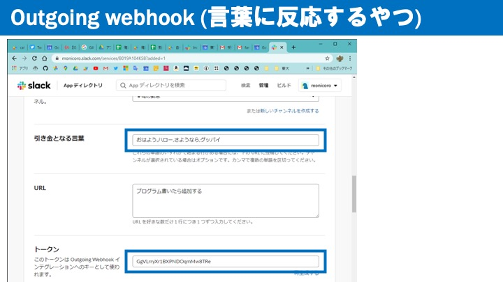

Outgoing webhookを利用したら、設定画面を開き、画像のような画面を確認してください。  

- 引き金となる言葉
- （プログラムの）URL
- トークン

の３つが大事になってきます。  
今回は勤怠管理を行うため、引き金となる言葉には、「おはよう,こんにちは,さようなら,おつかれさまでした」のような言葉を入力しましょう。


</br>

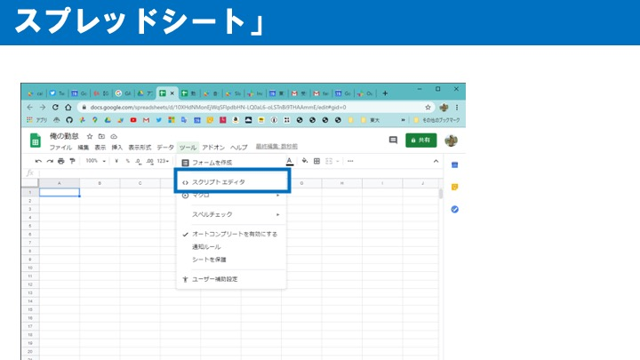

ではGASプロジェクトを作成していきましょう。  
先ほどとは異なり、GoogleDriveでスプレッドシートを新規作成し、`ツール->スクリプトエディタ`と進み、GASのエディタを開きます。  
このような手順を踏むことで、スプレッドシートとGASを簡単に連携することができます。  
（エクセルとVBAのような感覚です）  
以下を変更してください。　

- カレンダーID
- Outgoing Webhookのトークン
- SlackのメンバーID
- 勤怠開始の引き金となる言葉
- チャンネル名
- Botの名前
- Incoming webhookのURL

</br>

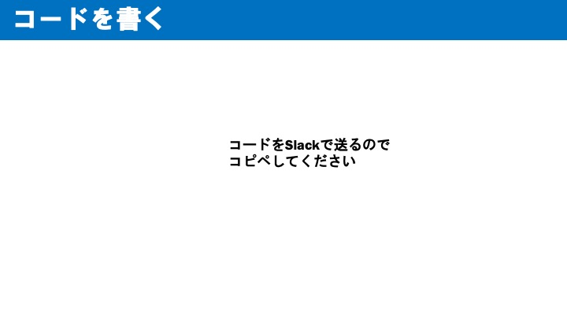

以下のコードをコピペして、変更しなければいけない点を変更してください。
```js
function doPost(e) {
  //シート1はシート名に応じて変更
  var sheet = SpreadsheetApp.getActiveSpreadsheet().getSheetByName('シート1');

  // googleカレンダーのID
  const calendar = CalendarApp.getCalendarById("")

  //Outgoing Webhookのトークン
  var token = ''

  //送られてきたトークンが正しければ勤怠を記録
  //parameterは必要に応じて変更
  if (token == e.parameter.token){
    // 地道にメンバーIDを取得する
    var id_to_name = {"U018HKTF7NE":"金子","xxxxxxxxxxxx":"XX",}
    var datetime     = new Date();
    var date         = (datetime.getFullYear()  + ('0' + (datetime.getMonth() + 1)).slice(-2) + ('0' + datetime.getDate()).slice(-2))
    var user_name    = id_to_name[e.parameter.user_id];
    var trigger_word = e.parameter.trigger_word;
    var text         = e.parameter.text;
    var list = ["in","おはよう","出勤","こんにちは"] // 勤怠開始の引き金となる言葉
    var message

    if (list.includes(trigger_word)) {
      // 出勤時のプログラム

      // 場所を追加するためのコード
      text = text.replace("＿","_")
      var mark = "_"
      var index = text.indexOf(mark)
      text = text.slice(index + 1)

      //追加する配列を作成
      array = ["",date,user_name,datetime,"",text];

      //シートの最下行に配列を記述
      sheet.appendRow(array);

      message = Utilities.formatString("%sさんが%sに%sしました．",user_name,text,trigger_word)

    } else {
      // 退勤時のプログラム
      message = Utilities.formatString("%sさん%s",user_name,trigger_word)

      for(var i=2; i<= sheet.getLastRow(); i++) {
        // カレンダーに登録済みならパス
        if (sheet.getRange(i, 1).getValue().toString() == "済") {
          continue;
        }
        // 日付とuser_nameが一致しているものを探す
        var in_date = sheet.getRange(i,2).getValue()
        var in_datetime = sheet.getRange(i,4).getValue()
        var in_name = sheet.getRange(i,3).getValue().toString()
        var in_location = sheet.getRange(i,6).getValue().toString()

        // 一致していたらoutの時間を登録，カレンダーにも登録
        if (( in_date == date ) && ( in_name == user_name )) {

          sheet.getRange(i,5).setValue(Utilities.formatDate(datetime,"JST", "yyyy/MM/dd HH:mm:ss"))
          var startTime = new Date(in_datetime)
          var endTime = datetime
          var options = {
            location: in_location
          }
          calendar.createEvent(user_name, startTime, endTime, options)
          sheet.getRange(i,1).setValue("済")
          break

        }
      }
    }
    var payload = {
      "text" : "\n" + message, // メッセージの本文
      "channel" : "#俺の勤怠", // チャネルの指定
      "username" : "勤怠管理クマ", // Botの名前
      }
    postSlack(payload);
  }
  return
}

function postSlack(payload)
{
  var options = {
    "method" : "POST",
    "payload" : JSON.stringify(payload)
  }

  var url = ""; // Incoming Webhook URL
  var response = UrlFetchApp.fetch(url, options);
  var content = response.getContentText("UTF-8");

}
```

</br>

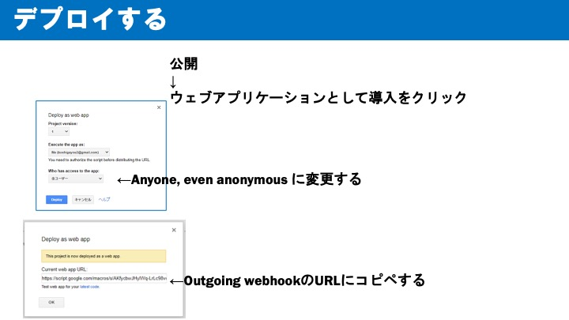

今回は定期実行ではなく、なんらかのアクションがあるたびに実行する為、デプロイします。  
エディタの上部の`公開`から画像のような手順でデプロイを行ってください。 
デプロイが完了したら、Slackで **「勤怠開始の引き金となる言葉_場所」** のように呟いてみましょう。これで勤怠開始となります。また、 **「勤怠終了の引き金となる言葉」** を呟くと、勤怠終了となり、Googleカレンダーに滞在時間と場所が追加されます。 

</br>

<hr>

## 例3 GASで何か作ろう

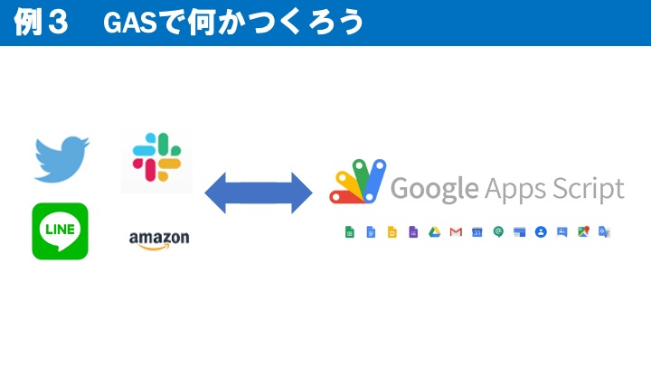

最後に、GASを使って何か作ってみましょう。今回はユーザーはSlackでアプリを操作しましたが、他にもTwitterやLINE、amazonなどが利用できます。  

</br>
<hr>

## おわりに
今回の経験が何か作ろうと思ったときに役立てば幸いです。  
金子健一郎